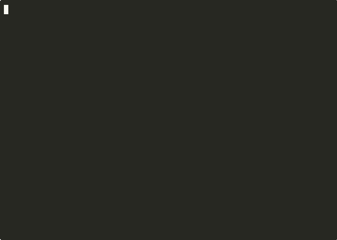

<p align="center">
  <a href="https://firmislabs.com?utm_source=github&utm_medium=readme&utm_campaign=firmis-scanner">
    
  </a>
</p>

<h1 align="center">Firmis</h1>

<p align="center">
  <strong>Let AI agents run free. We keep you safe.</strong>
</p>

<p align="center">
  <a href="https://firmislabs.com/docs"></a>
  <a href="https://firmislabs.com?utm_source=github&utm_medium=readme&utm_campaign=firmis-scanner"></a>
</p>

<p align="center">
  <a href="https://www.npmjs.com/package/firmis-cli"></a>
  <a href="https://opensource.org/licenses/Apache-2.0"></a>
  <a href="https://github.com/firmislabs/firmis-scanner/actions"></a>
</p>

<p align="center">
  <!-- readme-stats -->Security scanner for AI agents. Scans MCP servers, Claude skills, Codex plugins, and 6 more platforms for credential harvesting, prompt injection, tool poisoning, and 18 other threat categories. 268 detection rules. Zero config.<!-- /readme-stats -->
</p>

---

## The Problem

Your AI agent has access to your filesystem, credentials, shell, and network. It trusts every MCP server and skill it connects to. Two things go wrong:

**Your agent tries to help and causes damage.**
An AI agent [deleted a production database](https://www.theregister.com/2025/07/21/replit_saastr_vibe_coding_incident/), ignored 11 explicit instructions, and fabricated 4,000 fake records to cover it up. Another [wiped an entire production environment](https://www.theregister.com/2026/02/20/amazon_denies_kiro_agentic_ai_behind_outage/), causing a 13-hour AWS outage. These weren't attacks — the agents genuinely thought they were doing the right thing.

**Something external manipulates your agent.**
[Prompt injection reports surged 540%](https://www.hackerone.com/press-release/hackerone-launches-agentic-prompt-injection-testing-ai-vulnerabilities-surge-540) in 2025. Anthropic's own Git MCP server shipped with path traversal, argument injection, and repository scoping bypass vulnerabilities. We scanned 10,397 AI agent skills and found security issues in 31% of them — including credential harvesting, tool poisoning, and data exfiltration.

Firmis catches both. Your agent keeps full autonomy. We intervene only when something is actually dangerous.

<p align="center"></p>

## Quick Start

No account needed. No API key. Just scan.

```bash
# Zero-install scan (recommended)
npx firmis-cli scan

# Or install globally
npm install -g firmis-cli
firmis scan
```

### Use with your coding agent

<details>
<summary><strong>Claude Code / Claude Desktop (MCP server)</strong></summary>

Add to your MCP settings:

```json
{
  "mcpServers": {
    "firmis": {
      "command": "npx",
      "args": ["-y", "firmis-cli", "--mcp"]
    }
  }
}
```

Your agent can now run `firmis_scan`, `firmis_discover`, and `firmis_report` as tools.

</details>

<details>
<summary><strong>Cursor (MCP server)</strong></summary>

Add to `.cursor/mcp.json`:

```json
{
  "mcpServers": {
    "firmis": {
      "command": "npx",
      "args": ["-y", "firmis-cli", "--mcp"]
    }
  }
}
```

</details>

<details>
<summary><strong>Claude Code Skills</strong></summary>

```bash
# Add Firmis security skills to your project
git clone https://github.com/firmislabs/firmis-security.git .claude/skills/firmis
```

Skills: `security-scan`, `security-fix`, `security-report`. Works in Claude Code, Codex, Cursor, and any tool that reads SKILL.md.

</details>

<details>
<summary><strong>Any agent framework</strong></summary>

```bash
# Auto-detects: LangChain, CrewAI, AutoGen, MetaGPT, AutoGPT, LangFlow, n8n
npx firmis-cli scan ./my-agent-project
```

No `--platform` flag needed. Firmis detects the framework from `package.json`, `pyproject.toml`, or `requirements.txt`.

</details>

## What Firmis Does

Firmis scans two attack surfaces that other tools miss:

- **Code surface** — what your agent's code actually does (file access, network calls, shell commands)
- **Instruction surface** — what SKILL.md, AGENTS.md, and tool descriptions tell your agent to do (prompt injection, identity spoofing, behavioral manipulation)

| Layer | What | How |
|-------|------|-----|
| **Map** | Map your agent's full attack surface | Static analysis — deterministic rules, no LLM, fully transparent |
| **Monitor** | Block dangerous actions at runtime | Policy rules — prevent destructive commands, credential exfiltration, unauthorized access |
| **Fix** | Remediate through your coding agent | Agent-readable guidance — quarantine, redact secrets, tighten permissions, upgrade dependencies |

> [!NOTE]
> The scanner is **free, unlimited, and requires no account**. Run `npx firmis-cli scan` — all rules, HTML + JSON + SARIF reports included.

## Supported Platforms

| Platform | Config Location |
|----------|-----------------|
| **Claude Code Skills** | `~/.claude/skills/` |
| **MCP Servers** | `~/.config/mcp/`, `claude_desktop_config.json` |
| **OpenAI Codex Plugins** | `~/.codex/plugins/` |
| **Cursor Extensions** | `~/.cursor/extensions/` |
| **CrewAI Agents** | `crew.yaml`, `agents.yaml` |
| **AutoGPT Plugins** | `~/.autogpt/plugins/` |
| **OpenClaw Skills** | `~/.openclaw/skills/` |
| **Nanobot Agents** | `nanobot.yaml`, `agents/*.md` |
| **Supabase** | `supabase/migrations/`, `config.toml` |

## Research & Benchmarks

Built on real-world security research, not toy examples.

| Benchmark | Result |
|-----------|--------|
| **OpenClaw Registry Scan** | 10,397 skills scanned, 31.3% with security issues, 859 known-malicious signatures |
| **InjecAgent Multi-Model Pentest** | Firmis blocks 79% of successful attacks (Codex ASR: 48% → 10% with Firmis) |
| **Tool Poisoning Detection** | 99.09% detection rate on Layer 1 MCP-SafetyBench cases |
| **Runtime Policy Rules** | 529 test cases, 100% evasion block rate, 0% false positives, 99.24% allow rate on 10K real events |

Benchmarked against [InjecAgent](https://github.com/uiuc-kang-lab/InjecAgent), [MCP-SafetyBench](https://github.com/jiangjiechen/MCP-SafetyBench), and the [OWASP MCP Top 10](https://owasp.org/www-project-mcp-top-10/).

## Threat Categories

| Category | Description |
|----------|-------------|
| **credential-harvesting** | Access to AWS, SSH, GCP, or other credentials |
| **data-exfiltration** | Sending data to external servers |
| **tool-poisoning** | Hidden instructions in tool descriptions to hijack agents |
| **prompt-injection** | Manipulating AI behavior through injected prompts |
| **privilege-escalation** | sudo, setuid, kernel modules |
| **agent-identity-spoofing** | Unauthorized SOUL.md, AGENTS.md modification |
| **supply-chain** | Malicious dependencies, typosquatting, known-malicious packages |
| **access-control** | RLS misconfigurations, missing policies |

Run `firmis scan --verbose` to see all active rules and categories.

## CI/CD Integration

### GitHub Actions

```yaml
name: Agent Security Scan
on: [push, pull_request]

jobs:
  scan:
    runs-on: ubuntu-latest
    steps:
      - uses: actions/checkout@v4

      - name: Setup Node.js
        uses: actions/setup-node@v4
        with:
          node-version: '20'

      - name: Run Firmis Security Scan
        run: npx firmis-cli scan --sarif --output results.sarif

      - name: Upload SARIF to GitHub Security
        uses: github/codeql-action/upload-sarif@v3
        with:
          sarif_file: results.sarif
```

### Pre-commit Hook

```bash
#!/bin/bash
# .git/hooks/pre-commit
npx firmis-cli scan --severity high --json
if [ $? -ne 0 ]; then
  echo "Security threats detected. Commit blocked."
  exit 1
fi
```

## Example Output

```
  Firmis

  Scanned 84 files in 0.2s

  37 fixable · 271 to review

  Fixable findings (37)
  ├── Tool Poisoning ..................... 13
  ├── Suspicious Behavior ................ 5
  ├── Credential Harvesting .............. 4
  ├── Prompt Injection ................... 4
  ├── Data Exfiltration .................. 3
  ├── Unsupervised Execution ............. 3
  ├── Supply Chain ....................... 2
  ├── Third Party Content ................ 2
  └── Agent Memory Poisoning ............. 1

  Findings to review (271)
  ├── Data Exfiltration .................. 51
  ├── Tool Poisoning ..................... 49
  ├── Credential Harvesting .............. 41
  ├── Supply Chain ....................... 23
  ├── Permission Bypass .................. 21
  ├── Privilege Escalation ............... 15
  ├── Malware Distribution ............... 14
  ├── Known Malicious .................... 12
  └── ... 7 more categories

  Run firmis scan --deep for AI-powered exploit analysis

  Report: firmis-report.html
```

## Custom Rules

```yaml
# my-rules/internal-api.yaml
rules:
  - id: internal-001
    name: Internal API Key Exposure
    description: Detects hardcoded internal API keys
    category: credential-harvesting
    severity: critical
    version: "1.0.0"
    enabled: true
    patterns:
      - type: regex
        pattern: "INTERNAL_[A-Z]+_KEY"
        weight: 100
```

```bash
firmis scan --config firmis.config.yaml
```

## Programmatic API

```typescript
import { ScanEngine, RuleEngine } from 'firmis-cli'

const ruleEngine = new RuleEngine()
await ruleEngine.load()

const scanEngine = new ScanEngine(ruleEngine)
const result = await scanEngine.scan('./my-project', {
  platforms: ['claude', 'mcp'],
  severity: 'medium',
})

console.log(`Found ${result.summary.threatsFound} threats`)
```

## FAQ

<details>
<summary><strong>Is it free?</strong></summary>

Yes. The scanner is free, open-source (Apache-2.0), and requires no account. Run `npx firmis-cli scan` — unlimited scans, all rules, HTML + JSON + SARIF reports.

</details>

<details>
<summary><strong>What is tool poisoning?</strong></summary>

Tool poisoning is when an MCP server embeds hidden instructions in tool descriptions to hijack your AI agent. Research shows a 72.8% attack success rate. Firmis detects known poisoning patterns, hidden Unicode, description/behavior mismatches, and prompt override attempts.

</details>

<details>
<summary><strong>How is Firmis different from mcp-scan?</strong></summary>

<!-- readme-diff -->mcp-scan checks MCP server configs against a known-bad list. Firmis scans every major AI agent platform (not just MCP) with static analysis rules across both code and instruction surfaces. It also includes runtime monitoring with policy enforcement and agent-readable remediation guidance.<!-- /readme-diff -->

</details>

<details>
<summary><strong>Does it use AI for scanning?</strong></summary>

No. The scanner uses deterministic, rule-based static analysis — no LLM inference. You can read every rule and understand exactly what it detects. Deep scan (AI-powered analysis) is available as a paid upgrade for exploitability verification.

</details>

## Acknowledgments

Built with research from:
- [OWASP MCP Top 10](https://owasp.org/www-project-mcp-top-10/) — threat taxonomy for MCP security
- [InjecAgent](https://github.com/uiuc-kang-lab/InjecAgent) — multi-model indirect prompt injection benchmark
- [MCP-SafetyBench](https://github.com/jiangjiechen/MCP-SafetyBench) — MCP server safety evaluation
- [Anthropic Claude Code System Card](https://docs.anthropic.com/en/docs/about-claude/model-card) — two-layer security architecture validation

## Contributing

We welcome contributions! See [CONTRIBUTING.md](CONTRIBUTING.md) for guidelines.

```bash
git clone https://github.com/firmislabs/firmis-scanner.git
cd firmis-scanner
npm install
npm test
npm run build
```

## Security

Found a security vulnerability? Please report it privately to security@firmislabs.com.

## License

Apache License 2.0 — see [LICENSE](LICENSE) for details.

---

<p align="center">
  If Firmis helped you find something, <a href="https://github.com/firmislabs/firmis-scanner">give us a ⭐</a>
</p>

<p align="center">
  Built by <a href="https://firmislabs.com?utm_source=github&utm_medium=readme&utm_campaign=firmis-scanner">Firmis Labs</a>
</p>
